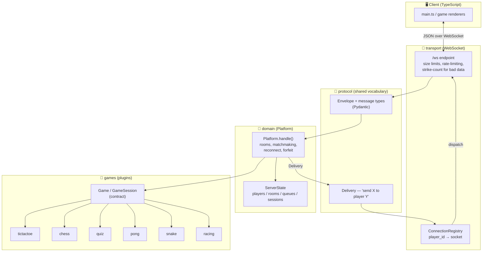
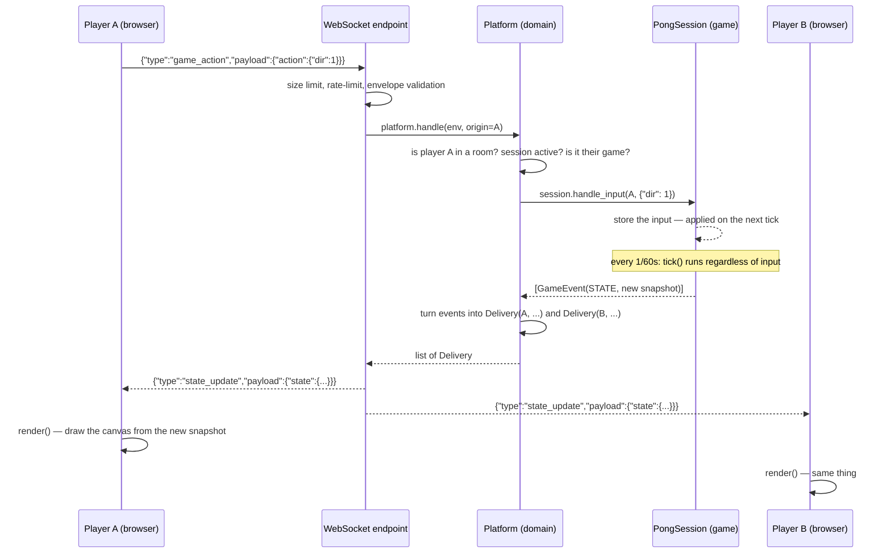

# 🎮 Multiplayer Game Platform

**A custom-built, fully authoritative realtime platform for playing games with others in the browser** — no accounts, no login, no downloads. You open the page, get a room code (or get matched with a random opponent), and play.

**🟢 Live right now:** **[mp-platform.duckdns.org](https://mp-platform.duckdns.org/)** — hosted on an Oracle Cloud "Always Free" instance. Open it in two tabs / on two devices and play with someone instantly.

> 🎥 *(Gameplay clips will go here)*

---

## Table of contents

- [What this is](#what-this-is)
- [Games](#games)
- [Tech stack](#tech-stack)
- [Architecture](#architecture)
- [Communication protocol (WebSocket)](#communication-protocol-websocket)
- [Data flow — from a click to the screen](#data-flow--from-a-click-to-the-screen)
- [Game model — how to add a new game](#game-model--how-to-add-a-new-game)
- [Disconnects, reconnects, and forfeits](#disconnects-reconnects-and-forfeits)
- [Transport resilience and safety](#transport-resilience-and-safety)
- [Persistence](#persistence)
- [Repository layout](#repository-layout)
- [Running it locally](#running-it-locally)
- [Tests](#tests)
- [Production deployment](#production-deployment)
- [Known limitations (MVP)](#known-limitations-mvp)
- [Possible next steps](#possible-next-steps)

---

## What this is

This isn't one game — it's a **game platform**. The core (transport, rooms, matchmaking, reconnects) knows nothing about the rules of any specific game. Games are **plugins** hooked into a single, stable contract (`Game` / `GameSession`). That's how the project went from 3 games (Tic-Tac-Toe, Chess, Quiz) to 6 without touching a single line of platform code — a new game is just a new folder under `games/`.

The key design decision: **the server is the single source of truth**. The client never sends game state — it only sends *intents* ("I want to move right", "I want to play e2e4"), and the server validates them, updates the state, and broadcasts the result to everyone involved. Without this, two players could end up seeing two different realities, or someone could cheat by editing JS in the browser console.

## Games

| Game | Players | Mode | Engine | Joining |
|---|---|---|---|---|
| ❌⭕ **Tic-Tac-Toe** | 2 | turn-based | pure Python logic | quick match / room code |
| ♟️ **Chess** | 2 | turn-based | full rules engine (castling, en passant, promotion, checkmate, stalemate, 50-move draw) | quick match / room code |
| 🧠 **"1 z dziesięciu"** (Polish elimination quiz) | 2–10 | turn-based, round-robin | 3 lives, a wrong answer costs a life | room code, host starts manually |
| 🏓 **Pong** | 2 | **realtime**, 60 ticks/s | continuous-time ball/paddle physics | quick match / room code |
| 🐍 **Snake Battle** | 2–4 | **realtime**, 8 ticks/s | snakes on a shared 20×20 grid, collisions resolved deterministically | room code |
| 🏎️ **Racing** | 2–4 | **realtime**, 24 ticks/s | a track with checkpoints and laps (backend engine is complete; client UI isn't wired up yet) | — |

Every turn-based game reacts to a single player action at a time. Realtime games (Pong, Snake, Racing) additionally run a server-side **tick loop** that advances the simulation (ball, snakes, cars) on its own, without waiting for player input, and broadcasts the new state — see [Realtime games: the tick loop](#realtime-games-the-tick-loop).

## Tech stack

**Backend** — Python 3.12, managed with `uv`:
- **FastAPI** — just two endpoints: `GET /health` and `WS /ws` (the entire game runs over WebSocket)
- **Pydantic** — every incoming message is validated (no unvalidated data ever touches game logic)
- **asyncio** — a single event loop, single-threaded; no locks needed, since state mutations never `await` mid-way through (see below)
- **SQLite** — history of finished games, written outside the realtime tick loop

**Frontend** — TypeScript + Vite, **no framework**:
- Plain DOM (`document.createElement`) + `<canvas>` for rendering realtime game boards
- Zero runtime dependencies — all UI logic is hand-written
- A single `protocol.ts` file mirroring the backend's message types

**Infrastructure**: Oracle Cloud (Always Free tier VM), one `uvicorn` process serving both the WebSocket API and the static client build, domain via DuckDNS.

## Architecture

The platform is split into four layers with a **strictly one-directional** dependency flow — a layer listed below never imports anything from a layer above it:



**The rule the tests enforce (`test_*_wiring.py`):** `transport → domain → games.base`. A game **never** imports transport or domain — it doesn't know what a WebSocket is, and it doesn't know what a room is. The platform **never** reaches into a specific game's internal state — it only ever talks to it through `handle_input()` / `snapshot()` / `result()`. This buys:
- unit-testing a game without spinning up a server at all (see `test_chess_game.py`, `test_pong_game.py`, …),
- adding a game can't risk breaking matchmaking or reconnect logic,
- the transport could in principle be swapped for something other than WebSocket without touching game logic.

`Delivery` (in `protocol/`) is the bridge between domain and transport — a transport-neutral "send this message to this player" instruction. Domain produces it, the WebSocket endpoint consumes it. Neither layer directly knows about the other.

## Communication protocol (WebSocket)

All communication goes over a single WebSocket (`/ws`) using one consistent JSON envelope in both directions:

```json
{ "type": "game_action", "seq": 42, "payload": { "action": { "dir": 1 } } }
```

- **`type`** — a string that selects which Pydantic schema validates the payload,
- **`seq`** — a monotonic counter set by the client; the server echoes it back, so the client can correlate a request with its response (useful for optimistic UI or debugging),
- **`payload`** — always an object, possibly empty.

Schemas are defined once, in `protocol/messages.py`, and **manually mirrored** on the client in `client/src/protocol.ts` — this is the one place in the project where backend and frontend have to stay in sync by hand (there's no schema generator; a deliberate MVP trade-off).

### Client → server messages

| Type | Purpose |
|---|---|
| `hello` | Handshake — the server issues an anonymous `player_id` (no accounts, no passwords) |
| `rejoin` | Return to an in-progress game after a dropped connection (`player_id` + `session_id` from `localStorage`) |
| `create_room` / `join_room` / `leave_room` | Room management via code |
| `list_rooms` | Populate the lobby with open rooms |
| `find_match` / `cancel_match` | Quick match — queue for a random opponent (2-player games only) |
| `start_game` | The host manually starts a variable-size game (quiz) |
| `game_action` | The **only** channel for in-game intents — a chess move, a snake direction, a quiz answer |
| `rematch` | Rematch voting — starts only once every connected player has voted |
| `ping` | Keepalive / RTT |

### Server → client messages

| Type | Purpose |
|---|---|
| `hello_ack` | Handshake confirmation + the assigned `player_id` |
| `room_created` / `room_joined` / `room_left` / `room_update` / `room_list` | Room lifecycle |
| `queue_ack` / `match_found` | Matchmaking status |
| `game_started` | The first snapshot of a freshly created session |
| `state_update` | The **most frequent** message — a full, self-contained snapshot of game state after every change |
| `game_over` | Final snapshot + result (`winner` / `draw` / `reason`) |
| `peer_disconnected` / `peer_reconnected` | Opponent (un)availability |
| `rematch_requested` | Current rematch vote count |
| `error` | A structured error from a closed set of codes (`ErrorCode`) — the client can react programmatically instead of parsing text |

Deliberate design choice: **`state_update` always carries the full state**, never a delta. That's a few more bytes on the wire, but it eliminates a whole class of sync bugs ("the client missed one message and drift accumulates") — if the client received a snapshot, it's 100% in sync with the server, end of discussion.

## Data flow — from a click to the screen

Here's the full path of a single move in Pong — the exact same shape (bigger or smaller) applies to every game and every action in the system:



A few important details of this flow:

1. **The client never computes physics or rules.** `state.ts` says it right in a comment: *"the client only stores what the server told it; it never computes game outcomes"*. The canvas in Pong/Snake/Racing is a pure function of `snapshot → pixels`.
2. **Realtime games run their own clock on the server**, independent of when players click anything. `Platform._run_ticks()` spawns an `asyncio.create_task` per session and calls `session.tick()` every `session.rate` seconds (60 Hz for Pong, 24 Hz for racing, 8 Hz for snake). Player input only *sets* an intended direction/target — the actual movement happens on the tick, so no player can outrun the physics by spamming messages.
3. **Turn-based games (chess, tic-tac-toe, quiz) have no tick** — `session.rate is None`, so `handle_input()` immediately returns the resulting `STATE`/`OVER` event and nothing runs in the background.
4. **Game events are abstract** (`GameEvent.STATE`, `GameEvent.OVER`) — the game itself never knows a WebSocket exists. It's `Platform._events_to_deliveries()` that translates them into concrete messages for concrete players (`state_update` to every session participant, `game_over` too, but with an added `result`).
5. **Concurrency without locks**: all mutable server state lives in a single process and a single event loop, and the architectural rule (spelled out right in a `domain/state.py` comment) is: *never `await` between reading state and committing the mutation*. Since there's no point where another coroutine could interleave mid-mutation, no `asyncio.Lock` is needed — a deliberate "one process, one conductor" trade-off, made possible by keeping all game state in RAM.

## Game model — how to add a new game

This is the entire contract a new game has to satisfy (`games/base.py`):

```python
class Game:
    id: str; name: str; min_players: int; max_players: int
    def create_session(self, player_ids) -> GameSession: ...

class GameSession:
    def start(self) -> list[GameEvent]: ...
    def handle_input(self, player_id, action: dict) -> list[GameEvent]: ...
    def tick(self) -> list[GameEvent]: ...          # realtime games only (self.rate is set)
    def remove_player(self, player_id) -> list[GameEvent]: ...
    def snapshot(self) -> dict: ...                  # full, serializable state
    def result(self) -> dict: ...                    # winner / draw / reason
```

Adding a game = a new folder under `games/<name>/` (engine + session) + one entry in `games/__init__.py::build_default_registry()`. Zero changes to `transport/`, `domain/`, or `protocol/`. That's exactly how Pong, Snake, and Racing were added on top of a platform that already worked for Tic-Tac-Toe and Chess.

### Realtime games: the tick loop

Games with a clock (Pong, Snake, Racing) inherit from `CountdownSession`, which gives them, for free:
- a **starting phase** (`"starting"`) — a 3-second countdown during which the board is frozen but input is already being accepted (so a held key immediately kicks in once play starts),
- **`tick_countdown()`**, which only emits a `state_update` when the number shown on screen actually changed — a 60 Hz game doesn't flood the network with 180 identical frames over a 3-second countdown.

Each realtime game uses a tick rate matched to how it plays: Pong at 60 Hz (smooth ball motion), Racing at 24 Hz (vehicle physics), Snake at 8 Hz (grid-based movement — a faster tick wouldn't matter, since a snake always moves a full cell at a time).

## Disconnects, reconnects, and forfeits

This is one of the more carefully handled parts of the platform, because in a WebSocket game a dropped connection is *normal*, not exceptional:

- The client keeps `player_id` and `session_id` in `localStorage`. On reopening the tab it sends `rejoin` instead of `hello` — the server re-attaches it to the running session and sends back a fresh `state_update` (the only signal that tells the client it's back in a game, not the lobby).
- When a player in a **2-player** game disconnects, the opponent gets `peer_disconnected`, and the server arms a **forfeit timer** (`reconnect_grace_seconds`, 10s by default). If the player doesn't come back in time, the match ends in a walkover, and the opponent gets `game_over` with `reason: "forfeit"`.
- In **multiplayer** games (quiz), a disconnected player is simply dropped from play (`session.remove_player`) — they don't block everyone else with a timer, since their absence doesn't invalidate the rest of the game.
- A **sweeper** (`Platform.run_sweeper`, every 30s) cleans up players who dropped and never came back — without it, every `hello` would leave a trace in memory forever, and abandoned rooms would keep counting against `max_rooms`.
- **Rematches are voted, not unilateral**: `rematch` only starts a new session once every currently connected player in the room has voted for it.

## Transport resilience and safety

The WebSocket endpoint (`main.py`) is deliberately "dumb" — it knows no game rules — but it guards against bad/hostile input before anything reaches the domain logic:

- **Message size limit** (64 KiB), checked *before* the JSON is even parsed.
- **Rate limiting** (token bucket, `RateLimiter`) on state-changing messages (`create_room`, `game_action`, `rejoin`, …) — spamming isn't a protocol violation, it's politely rejected with a `rate_limited` error.
- **A "strike" system**: protocol violations (an oversized message, malformed JSON) count as strikes; once a connection exceeds its budget (`max_dispatch_strikes`) it gets closed — one accidental glitch doesn't kick a player, persistent protocol abuse does.
- **Pydantic validation on every payload** with `extra="forbid"` — unknown fields in the JSON are rejected, not silently ignored.
- A game-logic error (`GameError`, e.g. an illegal move) **never kills the socket** — it comes back as a single `error` message to that player, and the game continues. An unexpected error (`except Exception`) doesn't drop the connection either — it's logged and returns `internal`.

## Persistence

The state of a **live** game (rooms, sessions, queues) lives entirely in RAM on purpose — this is an MVP and a process restart would lose it anyway, so there's no point syncing it anywhere. Only **finished** games are written to SQLite (`mp.db`): `game_id`, participants, winner, the full result, a timestamp — also exposed via `GET /history`.

An important performance detail: writing to SQLite (`_persist_game`) runs through `asyncio.to_thread`, i.e. **off** the event loop and away from a realtime game's tick loop — a disk write can never stall a 60 Hz Pong simulation.

## Repository layout

```
multiplayer-games-main/
├── server/                      Backend — FastAPI, project managed with uv
│   ├── src/mp/
│   │   ├── main.py              The only entry point: /health + WS /ws
│   │   ├── config.py            Settings (limits, ports, DB path) — overridable via env vars
│   │   ├── storage.py           SQLite — history of finished games
│   │   ├── transport/           Client, ConnectionRegistry, rate limiter — zero game rules
│   │   ├── protocol/            Envelope, message types (Pydantic), Delivery, error codes
│   │   ├── domain/               Platform — rooms, matchmaking, reconnect, sweeper, session lifecycle
│   │   └── games/
│   │       ├── base.py          The Game / GameSession / CountdownSession contract
│   │       ├── registry.py      Game registry
│   │       ├── tictactoe/ chess/ quiz/ pong/ snake/ racing/
│   │       └── __init__.py      build_default_registry() — the only place that "knows" every game at once
│   └── tests/                    22 test files: game engines, platform↔game wiring, protocol, reconnect, sweep…
└── client/                       Frontend — Vite + TypeScript, no framework
    └── src/
        ├── main.ts               App state reducer + UI wiring
        ├── net/ws.ts              Thin WebSocket wrapper with auto-reconnect (backoff)
        ├── protocol.ts            Message types mirrored from the backend
        ├── state.ts               The client's single source of truth (never computes outcomes itself)
        ├── input.ts               Keyboard / touch / swipe input for realtime games
        └── games/                 Per-game renderers (canvas for Pong/Snake, DOM for the rest)
```

## Running it locally

**Backend** (in `server/`):

```powershell
uv sync
uv run uvicorn mp.main:app --reload      # http://127.0.0.1:8000
```

**Frontend** (in `client/`, second terminal):

```powershell
pnpm install
pnpm dev                                 # http://127.0.0.1:5173
```

`pnpm dev` proxies `/ws` and `/health` to the backend (see `vite.config.ts`), so the browser talks to a single origin — exactly like in production, no CORS involved. Open `http://127.0.0.1:5173` in two tabs (or two browsers), pick a game in the lobby, have one tab create a room / find a match, and join with the code from the other.

## Tests

```powershell
cd server && uv run pytest -q      # 22 test files: engines, wiring, protocol, reconnect, sweep, matchmaking...
cd client && pnpm build            # tsc --noEmit + build — catches type errors before shipping
```

Tests are split exactly along the architectural boundaries: `test_chess_game.py` / `test_pong_game.py` / `test_snake_game.py` / `test_racing_game.py` test the **pure game engines** with no server involved at all, while separate `test_*_wiring.py` files test only that a given game correctly "plugs into" the platform (matchmaking, starting, ending a game) — with no knowledge of that game's own rules.

## Production deployment

The app runs on an **Oracle Cloud Free Tier ("Always Free")** VM at **[mp-platform.duckdns.org](https://mp-platform.duckdns.org/)** (the domain is via DuckDNS, since the free tier doesn't come with a static address and ready-made DNS). Because game state lives in the RAM of a single process, the architecture deliberately assumes **exactly one server instance** — restarting the process drops any active games (acceptable for an MVP; nobody's paying a subscription for this). WebSocket traffic goes through a reverse proxy terminating TLS (since `wss://` needs a certificate), and `uvicorn` runs as a systemd service with auto-restart, to survive a process crash or a machine reboot.

## Known limitations (MVP)

- **No accounts or passwords** — a player's identity is just a random `player_id` issued on `hello`; anyone with a link to the server can play.
- **Game state lives entirely in RAM** — a backend restart means losing every in-progress match (the SQLite history of finished games survives).
- **A single server instance** — no state sharing across processes/machines; horizontal scaling would mean moving state out of the process (e.g. to Redis) — deliberately deferred as "not today".
- **Racing has a complete server-side engine but no client renderer yet** — playable only programmatically/in tests, not from the UI.

## Possible next steps

- Wire up the Racing UI (the engine is already there: track, checkpoints, laps, vehicle physics).
- Leaderboards / stats built on top of the SQLite `games` table (the data is already being collected — only the view is missing).
- Spectator mode — `Delivery` and `ConnectionRegistry` already support addressing an arbitrary player, so adding a non-voting "observer" role is a natural next step.
- Horizontal scaling by moving `ServerState` out of the process (Redis/pub-sub) — currently skipped on purpose, since a single instance is enough for an MVP.
