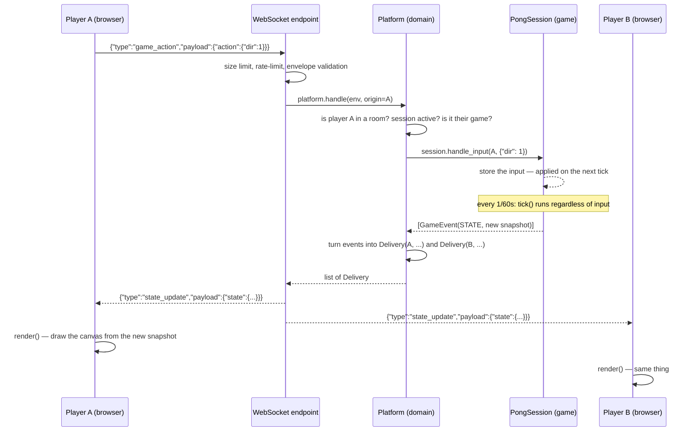

# 🎮 Multiplayer Game Platform

**A custom-built, fully authoritative realtime platform for playing games with others in the browser** — no accounts, no login, no downloads. You open the page, get a room code (or get matched with a random opponent), and play.

**🟢 Live right now:** **[mp-platform.duckdns.org](https://mp-platform.duckdns.org/)** — hosted on an Oracle Cloud "Always Free" instance. Open it in two tabs / on two devices and play with someone instantly.

---

## Table of contents

- [What this is](#what-this-is)
- [Games](#games)
- [Tech stack](#tech-stack)
- [Architecture](#architecture)
- [Communication protocol (WebSocket)](#communication-protocol-websocket)
- [Data flow — from a click to the screen](#data-flow--from-a-click-to-the-screen)
- [Game model — how to add a new game](#game-model--how-to-add-a-new-game)
- [Disconnects, reconnects, and forfeits](#disconnects-reconnects-and-forfeits)
- [Transport resilience and safety](#transport-resilience-and-safety)
- [Persistence](#persistence)
- [Configuration](#configuration)
- [Client](#client)
- [Repository layout](#repository-layout)
- [Running it locally](#running-it-locally)
- [Tests](#tests)
- [Production deployment](#production-deployment)
- [Known limitations (MVP)](#known-limitations-mvp)
- [Possible next steps](#possible-next-steps)

---

## What this is

This isn't one game — it's a **game platform**. The core (transport, rooms, matchmaking, reconnects) knows nothing about the rules of any specific game. Games are **plugins** hooked into a single, stable contract (`Game` / `GameSession`). That's how the project grew from 3 games (Tic-Tac-Toe, Chess, Quiz) to 5 (adding Pong and Snake Battle) without touching a single line of platform code — a new game is just a new folder under `games/` (plus a renderer on the client).

The key design decision: **the server is the single source of truth**. The client never sends game state — it only sends *intents* ("I want to move right", "I want to play e2e4"), and the server validates them, updates the state, and broadcasts the result to everyone involved. Without this, two players could end up seeing two different realities, or someone could cheat by editing JS in the browser console.

## Games

| Game | Players | Mode | Engine | Joining |
|---|---|---|---|---|
| ❌⭕ **Tic-Tac-Toe** | 2 | turn-based | pure Python logic; who plays X (and moves first) is random | quick match / room code |
| ♟️ **Chess** | 2 | turn-based | full rules engine: castling, en passant, promotion, check, checkmate, stalemate, 50-move draw, insufficient-material draw | quick match / room code |
| 🧠 **Quiz** | 2–10 | turn-based, round-robin | 3 lives, a wrong answer costs a life, a correct one scores a point; 103 English questions in 8 categories | room code, host starts manually |
| 🏓 **Pong** | 2 | **realtime**, 60 ticks/s | continuous-time ball/paddle physics; first to 5 points; the ball speeds up 5% on every paddle hit (up to 3×) | quick match / room code |
| 🐍 **Snake Battle** | 2–4 | **realtime**, 8 ticks/s | snakes on a shared 20×20 grid, collisions resolved deterministically; last snake alive wins | room code (auto-starts when 4 have joined, otherwise the host presses Start) |

Every turn-based game reacts to a single player action at a time. Realtime games (Pong, Snake) additionally run a server-side **tick loop** that advances the simulation (ball, snakes) on its own, without waiting for player input, and broadcasts the new state — see [Realtime games: the tick loop](#realtime-games-the-tick-loop).

Game-specific details worth knowing:

- **Quick match** is available only for 2-player games (Tic-Tac-Toe, Chess, Pong); the server rejects it for Quiz and Snake.
- **Chess** colours: the first player in the room's roster plays white (for a room that's the host; in quick match it's the player who was waiting in the queue). The server sends every legal move in each snapshot, so the client only highlights destinations — it never computes legality. The engine accepts a `promo` piece (`q`/`r`/`b`/`n`, default queen), but the current UI has no promotion picker, so pawns always promote to a queen. There is no threefold-repetition rule.
- **Quiz** never leaks the answer key: snapshots carry only the question text, options and category. The correct answer is revealed through `last_feedback` once someone has answered. If the pool runs out, the highest score among surviving players wins (a tie is a draw).
- **Pong** sides are assigned randomly at the start of each session. Paddles are controlled either by a held direction (`{"dir": -1|0|1}`, keyboard) or by a finger target (`{"target": y}`); in both cases the paddle moves at its normal speed, so a finger can't teleport it.
- **Snake Battle** queues up to 3 turns per player, so a quick "up, then left" swipe isn't collapsed into just "left". Head-on swaps and head-into-body collisions kill snakes; if everyone dies together, the winner is decided by score, then length, then join order.

## Tech stack

**Backend** — Python 3.12+, managed with `uv`:
- **FastAPI** — three endpoints: `GET /health`, `GET /history` and `WS /ws` (the entire game runs over WebSocket)
- **Pydantic** — every incoming message is validated (no unvalidated data ever touches game logic)
- **asyncio** — a single event loop, single-threaded; no locks needed, since state mutations never `await` mid-way through (see below)
- **SQLite** — history of finished games, written outside the realtime tick loop

**Frontend** — TypeScript + Vite, **no framework**:
- Plain DOM (`document.createElement`) + `<canvas>` for the realtime game boards (Pong, Snake)
- Zero runtime dependencies — all UI logic is hand-written
- A single `protocol.ts` file mirroring the backend's message types

**Infrastructure**: Oracle Cloud (Always Free tier VM), `uvicorn` behind a reverse proxy, domain via DuckDNS.

## Architecture

The platform is split into four layers with a **strictly one-directional** dependency flow — a layer listed below never imports anything from a layer above it.


**The rule the tests enforce (`test_*_wiring.py`):** `transport → domain → games.base`. A game **never** imports transport or domain — it doesn't know what a WebSocket is, and it doesn't know what a room is. The platform **never** reaches into a specific game's internal state — it only ever talks to it through `handle_input()` / `tick()` / `snapshot()` / `result()`. This buys:
- unit-testing a game without spinning up a server at all (see `test_chess_game.py`, `test_pong_game.py`, …),
- adding a game can't risk breaking matchmaking or reconnect logic,
- the transport could in principle be swapped for something other than WebSocket without touching game logic.

`Delivery` (in `protocol/`) is the bridge between domain and transport — a transport-neutral "send this message to this player" instruction. Domain produces it, the WebSocket endpoint consumes it. Neither layer directly knows about the other.

## Communication protocol (WebSocket)

All communication goes over a single WebSocket (`/ws`) using one consistent JSON envelope in both directions:

```json
{ "type": "game_action", "seq": 42, "payload": { "action": { "dir": 1 } } }
```

- **`type`** — a string that selects which Pydantic schema validates the payload,
- **`seq`** — an optional client-set counter; the server echoes it back on direct replies to that client, so the client can correlate a request with its response. It is *not* used for ordering or deduplication,
- **`payload`** — always an object, possibly empty.

Schemas are defined once, in `protocol/messages.py`, and **manually mirrored** on the client in `client/src/protocol.ts` — this is the one place in the project where backend and frontend have to stay in sync by hand (there's no schema generator; a deliberate MVP trade-off).

### Client → server messages

| Type | Purpose |
|---|---|
| `hello` | Handshake — the server issues an anonymous `player_id` (no accounts, no passwords) |
| `rejoin` | Return to an in-progress game after a dropped connection (`player_id` + `session_id` from `localStorage`) |
| `create_room` / `join_room` / `leave_room` | Room management via code |
| `list_rooms` | Populate the lobby with open rooms |
| `find_match` / `cancel_match` | Quick match — queue for a random opponent (2-player games only) |
| `start_game` | The host manually starts a variable-size game (Quiz, Snake with fewer than 4 players) |
| `game_action` | The **only** channel for in-game intents — a chess move, a snake direction, a paddle direction/target, a quiz answer |
| `rematch` | Rematch voting — starts only once every connected player has voted |
| `ping` | Keepalive / RTT |

### Server → client messages

| Type | Purpose |
|---|---|
| `hello_ack` | Handshake confirmation + the assigned `player_id` |
| `room_created` / `room_joined` / `room_left` / `room_update` / `room_list` | Room lifecycle |
| `queue_ack` / `match_found` | Matchmaking status |
| `game_started` | The first snapshot of a freshly created session (+ `session_id`) |
| `state_update` | The **most frequent** message — a full, self-contained snapshot of game state after every change |
| `game_over` | Final snapshot + result (`winner` / `draw` / `reason`, …) |
| `peer_disconnected` / `peer_reconnected` | Opponent (un)availability |
| `rematch_requested` | Current rematch vote count |
| `pong` | Reply to `ping` |
| `error` | A structured error from a closed set of codes (`ErrorCode`) — the client can react programmatically instead of parsing text |

Error codes: `not_in_room`, `room_not_found`, `room_full`, `already_in_room`, `invalid_action`, `invalid_room_slot`, `malformed_message`, `unknown_type`, `oversized_message`, `rate_limited`, `protocol_violation`, `internal`.

Deliberate design choice: **`state_update` always carries the full state**, never a delta. That's a few more bytes on the wire, but it eliminates a whole class of sync bugs ("the client missed one message and drift accumulates") — if the client received a snapshot, it's 100% in sync with the server, end of discussion.

## Data flow — from a click to the screen

Here's the full path of a single move in Pong — the exact same shape (bigger or smaller) applies to every game and every action in the system:



A few important details of this flow:

1. **The client never computes physics or rules.** `state.ts` says it right in a comment: *"the client only stores what the server told it; it never computes game outcomes"*. The canvas in Pong/Snake is a pure function of `snapshot → pixels` (Pong additionally interpolates between snapshots purely for visual smoothness).
2. **Realtime games run their own clock on the server**, independent of when players click anything. `Platform._start_session()` spawns an `asyncio.create_task` per realtime session, and `_run_ticks()` calls `session.tick()` every `session.rate` seconds (60 Hz for Pong, 8 Hz for Snake) and pushes the resulting deliveries. Player input only *sets* an intended direction/target — the actual movement happens on the tick, so no player can outrun the physics by spamming messages.
3. **Turn-based games (chess, tic-tac-toe, quiz) have no tick** — `session.rate is None`, so `handle_input()` immediately returns the resulting `STATE`/`OVER` events and nothing runs in the background.
4. **Game events are abstract** (`GameEvent.STATE`, `GameEvent.OVER`) — the game itself never knows a WebSocket exists. It's `Platform._events_to_deliveries()` that translates them into concrete messages for concrete players (`state_update` to every session participant, `game_over` too, but with an added `result`).
5. **Concurrency without locks**: all mutable server state lives in a single process and a single event loop, and the architectural rule (spelled out right in a `domain/state.py` comment) is: *never `await` between reading state and committing the mutation*. Since there's no point where another coroutine could interleave mid-mutation, no `asyncio.Lock` is needed — a deliberate "one process, one conductor" trade-off, made possible by keeping all game state in RAM.

## Game model — how to add a new game

This is the entire contract a new game has to satisfy (`games/base.py`):

```python
class Game:
    id: str; name: str; min_players: int; max_players: int
    def create_session(self, player_ids) -> GameSession: ...

class GameSession:
    rate: float | None                               # seconds per tick; None = turn-based
    def start(self) -> list[GameEvent]: ...
    def handle_input(self, player_id, action: dict) -> list[GameEvent]: ...
    def tick(self) -> list[GameEvent]: ...          # realtime games only (self.rate is set)
    def remove_player(self, player_id) -> list[GameEvent]: ...   # multi-player games
    def snapshot(self) -> dict: ...                  # full, serializable state
    def result(self) -> dict: ...                    # winner / draw / reason
```

A game signals illegal input by raising `GameError`; the platform turns it into an `error` message for that player only and the session stays valid.

**Server side**, adding a game = a new folder under `games/<name>/` (pure rules engine + session) + one `registry.register(...)` line in `games/__init__.py::build_default_registry()`. Zero changes to `transport/`, `domain/`, or `protocol/`. That's exactly how Pong and Snake were added on top of a platform that already worked for Tic-Tac-Toe, Chess and Quiz.

**Client side**, it needs a renderer in `client/src/games/<name>/render.ts` and entries in `client/src/games/index.ts` (`GAME_RENDERERS`, `GAME_NAMES`, and `QUICK_MATCH_GAMES` if it's a 2-player game). Optionally a "How to play" panel in `howto.ts`.

How a room becomes a game: when the room is **full** (`max_players`), the session starts automatically — this is what happens for the 2-player games. Variable-size games (Quiz 2–10, Snake 2–4 unless full) are started by the host with `start_game`, as long as the player count is within `min_players`..`max_players`.

### Realtime games: the tick loop

Games with a clock (Pong, Snake) inherit from `CountdownSession`, which gives them, for free:
- a **starting phase** (`"starting"`) — a 3-second countdown during which the board is frozen but input is already being accepted (so a held key immediately kicks in once play starts),
- **`tick_countdown()`**, which only emits a `state_update` when the number shown on screen actually changed — a 60 Hz game doesn't flood the network with 180 identical frames over a 3-second countdown.

Each realtime game uses a tick rate matched to how it plays: Pong at 60 Hz (smooth ball motion), Snake at 8 Hz (grid-based movement — a faster tick wouldn't matter, since a snake always moves a full cell at a time). Pong re-enters the countdown after every point.

## Disconnects, reconnects, and forfeits

This is one of the more carefully handled parts of the platform, because in a WebSocket game a dropped connection is *normal*, not exceptional:

- The client keeps `player_id` and `session_id` in `localStorage`. On reopening the tab it sends `rejoin` instead of `hello` — the server re-attaches it to the running session and sends back a fresh `state_update` to everyone in the session (the only signal that tells the client it's back in a game, not the lobby). If the stored session is stale (server restarted, game ended), the client falls back to a fresh `hello`.
- When a player in a **2-player session** disconnects, the opponent gets `peer_disconnected`, and the server arms a **forfeit timer** (`reconnect_grace_seconds`, 10s by default). If the player doesn't come back in time, the match ends in a walkover, and the opponent gets `game_over` with `reason: "forfeit"`.
- In sessions with **three or more players**, a disconnect does not arm a timer: the others are notified with `peer_disconnected` and the game carries on. The disconnected player stays in the session (and can `rejoin`); they are only removed from play when they explicitly **leave the room** (`session.remove_player`). See [Known limitations](#known-limitations-mvp) for the consequence in Quiz.
- **Leaving a room mid-game**: in a duel the remaining player wins immediately (`reason: "abandoned"`); in a multi-player game the leaver is removed and the rest keep playing.
- A **sweeper** (`Platform.run_sweeper`, every 30s) forgets players who dropped and never came back (after the grace window + 5s) — without it, every `hello` would leave a trace in memory forever, and abandoned rooms would keep counting against `max_rooms`. It never tears down a room while someone else in it is still connected.
- **Rematches are voted, not unilateral**: `rematch` only starts a new session once every currently connected player in the room has voted for it.

## Transport resilience and safety

The WebSocket endpoint (`main.py`) is deliberately "dumb" — it knows no game rules — but it guards against bad/hostile input before anything reaches the domain logic:

- **Message size limit** (64 KiB by default), checked *before* the JSON is even parsed.
- **Rate limiting** (token bucket, `RateLimiter`: capacity 40, refill 20 tokens/s) on state-changing messages (`create_room`, `join_room`, `leave_room`, `find_match`, `cancel_match`, `start_game`, `game_action`, `rematch`, `rejoin`) — spamming isn't a protocol violation, it's politely rejected with a `rate_limited` error. The client throttles Pong finger-drag updates to ~16/s to stay under this budget.
- **A "strike" system**: protocol violations (an oversized message, malformed JSON/envelope) count as strikes; once a connection reaches its budget (`max_dispatch_strikes`, 3 by default) it gets closed — one accidental glitch doesn't kick a player, persistent protocol abuse does.
- **Pydantic validation on every payload** with `extra="forbid"` — unknown fields in the JSON are rejected, not silently ignored.
- A second `hello` on an already-bound connection is rejected, and nothing but `hello`/`rejoin` is accepted before the handshake.
- A game-logic error (`GameError`, e.g. an illegal move) **never kills the socket** — it comes back as a single `error` message to that player, and the game continues. An unexpected error (`except Exception`) doesn't drop the connection either — it's logged and returns `internal`.

## Persistence

The state of a **live** game (rooms, sessions, queues) lives entirely in RAM on purpose — this is an MVP and a process restart would lose it anyway, so there's no point syncing it anywhere. Only **finished** games are written to SQLite (`mp.db`, WAL mode), into a single `games` table: `id`, `game_id`, `players` (JSON), `winner`, `result` (JSON), `played_at` (UTC ISO timestamp). Games that ended by forfeit or by someone leaving are recorded too. `GET /history` returns the 20 most recent.

Two details to be aware of:
- Writing to SQLite (`_persist_game`) runs through `asyncio.to_thread`, i.e. **off** the event loop and away from a realtime game's tick loop — a disk write can never stall a 60 Hz Pong simulation.
- The `winner` column stores whatever the game's `result()` reports: a **player id** for most games, but a **symbol** (`"X"`/`"O"`) for Tic-Tac-Toe.

The database path is relative to the working directory by default (`mp.db`), so running from `server/` creates `server/mp.db`. Persistence is disabled when `db_path` is `None` (the test settings).

## Configuration

Settings live in a frozen `Settings` dataclass (`config.py`). These can be overridden with environment variables:

| Variable | Default | Meaning |
|---|---|---|
| `MP_MAX_MSG_BYTES` | `65536` | Maximum size of a single incoming message |
| `MP_MAX_STRIKES` | `3` | Protocol violations before a connection is closed |
| `MP_MAX_ROOMS` | `128` | Cap on concurrently existing rooms |
| `MP_DB` | `mp.db` | SQLite file path |
| `MP_HOST`, `MP_PORT` | `127.0.0.1`, `8000` | Read into `Settings`, but **not used to bind the server** — the bind address comes from the `uvicorn` command line (`--host` / `--port`) |

Rate-limit parameters, `reconnect_grace_seconds` (10s) and `sweep_interval_seconds` (30s) are `Settings` fields with defaults but no environment override.

## Client

A framework-free TypeScript app (`client/src/`):

- **`main.ts`** — the message reducer + render loop. Screens: lobby (game picker, quick match, create room, join by code, open-room list, "your room" card with copy-code button) and game (board, role chip, turn line, result, "Play again", "Leave room").
- **`net/ws.ts`** — thin WebSocket wrapper with automatic reconnect (exponential backoff, 500 ms doubling up to 5 s). `main.ts` decides between `hello` and `rejoin` on every (re)connect.
- **`state.ts`** — the client's single state object; it only stores what the server said.
- **`input.ts`** — realtime input. Pong: drag a finger/mouse up and down anywhere on the board (relative drag, so your finger never hides the ball) or use ↑/↓. Snake: swipe on the board or use the arrow keys. Keys and swipes are sent only when the direction changes.
- **`games/`** — one renderer per game (DOM for Tic-Tac-Toe, Chess and Quiz; `<canvas>` for Pong and Snake), plus shared canvas helpers.
- **`howto.ts`** — "How to play" panel (currently only for Snake Battle).

During development Vite serves the client on `:5173` and proxies `/ws` and `/health` to the backend on `:8000`, so the browser always talks to a single origin (no CORS). The WebSocket URL is derived from `location` (`ws://` or `wss://`).

## Repository layout

```
multiplayer-games-main/
├── server/                      Backend — FastAPI, project managed with uv
│   ├── pyproject.toml
│   ├── src/mp/
│   │   ├── main.py              The only entry point: /health, /history, WS /ws
│   │   ├── config.py            Settings (limits, ports, DB path) — partly overridable via env vars
│   │   ├── storage.py           SQLite — history of finished games
│   │   ├── transport/           Client, ConnectionRegistry, rate limiter — zero game rules
│   │   ├── protocol/            Envelope, message types (Pydantic), Delivery, error codes
│   │   ├── domain/              Platform — rooms, matchmaking, reconnect, sweeper, session lifecycle
│   │   └── games/
│   │       ├── base.py          The Game / GameSession / CountdownSession contract
│   │       ├── registry.py      Game registry
│   │       ├── tictactoe/ chess/ quiz/ pong/ snake/     (game.py = pure rules, session.py = plugin)
│   │       └── __init__.py      build_default_registry() — the only place that "knows" every game at once
│   └── tests/                   20 test files, 140 tests: game engines, platform↔game wiring, protocol, reconnect, sweep…
└── client/                      Frontend — Vite + TypeScript, no framework
    ├── index.html
    ├── vite.config.ts           Dev proxy for /ws and /health
    └── src/
        ├── main.ts              App state reducer + UI wiring
        ├── net/ws.ts            WebSocket wrapper with auto-reconnect (backoff)
        ├── protocol.ts          Message types mirrored from the backend
        ├── state.ts             The client's single source of truth (never computes outcomes itself)
        ├── input.ts             Keyboard / touch / swipe input for realtime games
        ├── howto.ts             "How to play" panels
        ├── styles.css
        └── games/               Per-game renderers (index.ts routes by game id)
```

## Running it locally

Requirements: Python 3.12+ with [`uv`](https://docs.astral.sh/uv/), and Node.js with `pnpm` (`npm` also works — the repo contains both lockfiles).

**Backend** (in `server/`):

```bash
uv sync --extra dev                      # --extra dev also installs the test dependencies
uv run uvicorn mp.main:app --reload      # http://127.0.0.1:8000
```

**Frontend** (in `client/`, second terminal):

```bash
pnpm install
pnpm dev                                 # http://127.0.0.1:5173
```

`pnpm dev` proxies `/ws` and `/health` to the backend (see `vite.config.ts`), so the browser talks to a single origin — exactly like in production, no CORS involved. Open `http://127.0.0.1:5173` in two tabs (or two browsers), pick a game in the lobby, have one tab create a room / find a match, and join with the code from the other.

## Tests

```bash
cd server && uv run pytest -q      # 140 tests: engines, wiring, protocol, reconnect, sweep, matchmaking...
cd client && pnpm build            # tsc --noEmit + build — catches type errors before shipping
```

Tests are split along the architectural boundaries: `test_chess_game.py` / `test_pong_game.py` / `test_snake_game.py` / `test_tictactoe_game.py` test the **pure game engines** with no server involved at all, while the `test_*_wiring.py` files test only that a given game correctly "plugs into" the platform (matchmaking, starting, ending a game) — with no knowledge of that game's own rules.


## Production deployment

The app runs on an **Oracle Cloud Free Tier ("Always Free")** VM at **[mp-platform.duckdns.org](https://mp-platform.duckdns.org/)** (the domain is via DuckDNS, since the free tier doesn't come with ready-made DNS). The backend (`uvicorn`) only serves `/health`, `/history` and `/ws` — it does **not** serve the client itself, so the output of `pnpm build` (`client/dist`) has to be served by a reverse proxy / static file server that also forwards `/ws` (WebSocket upgrade) and the API routes to `uvicorn`, and terminates TLS (`wss://` needs a certificate). No deployment files (proxy config, systemd unit) are part of this repository.

Because game state lives in the RAM of a single process, the architecture deliberately assumes **exactly one server instance** — restarting the process drops any active games (acceptable for an MVP).

## Known limitations (MVP)

- **No accounts or passwords** — a player's identity is just a random `player_id` issued on `hello`; anyone with a link to the server can play.
- **Game state lives entirely in RAM** — a backend restart means losing every in-progress match (the SQLite history of finished games survives).
- **A single server instance** — no state sharing across processes/machines; horizontal scaling would mean moving state out of the process (e.g. to Redis) — deliberately deferred.
- **A disconnected player in a 3+ player game isn't skipped.** In Quiz, if the disconnected player's turn comes up the game waits for them to rejoin or leave the room; in Snake their snake simply keeps going straight until it crashes.
- **Chess:** no promotion picker in the UI (always queen) and no threefold-repetition draw.
- **Protocol types are mirrored by hand** between `messages.py` and `protocol.ts`.
- **Some Pong tests are stale** (see [Tests](#tests)).

## Possible next steps

- Chess: promotion picker and threefold repetition.
- Leaderboards / stats built on top of the SQLite `games` table (the data is already being collected — only the view is missing; note the Tic-Tac-Toe `winner` is a symbol, not a player id).
- Spectator mode — `Delivery` and `ConnectionRegistry` already support addressing an arbitrary player, so adding a non-voting "observer" role is a natural next step.
- Horizontal scaling by moving `ServerState` out of the process (Redis/pub-sub) — currently skipped on purpose, since a single instance is enough for an MVP.
